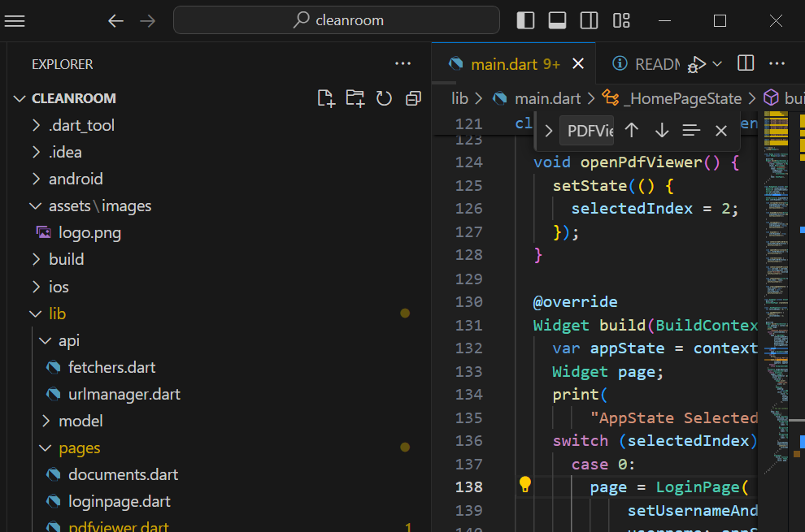

# cleanroom

Cleanroom, an implementation of the take home project from Harvey

## Components

This is the flutter frontend portion 

## How to run 

I used VSCode with Flutter to run this project. With VSCode, you can open HarveyProject/flutter_frontend, go to main.dart, and press the debug button at the top right of the window. This will run the frontend on localhost. 

